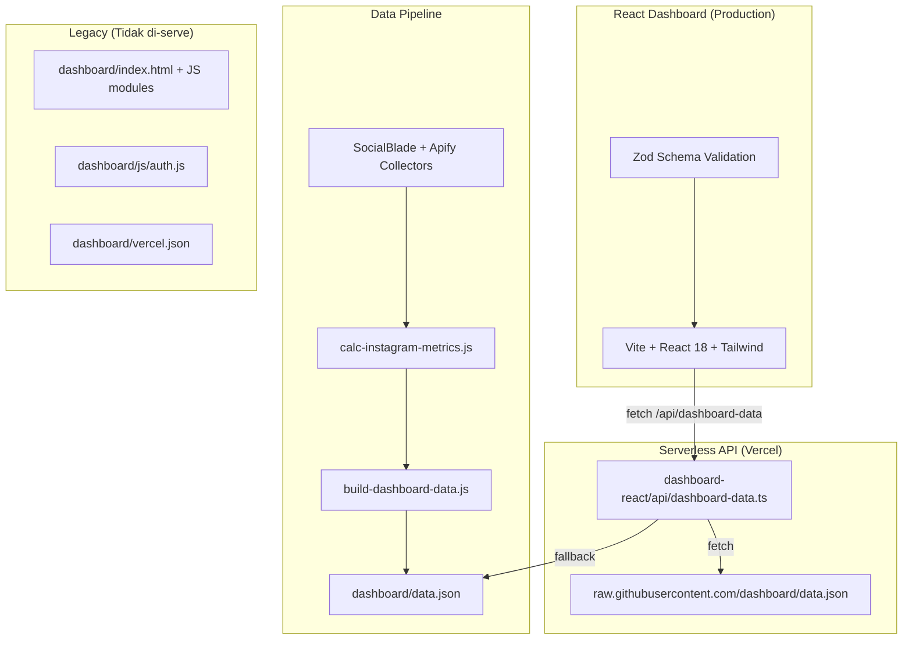
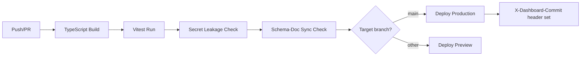
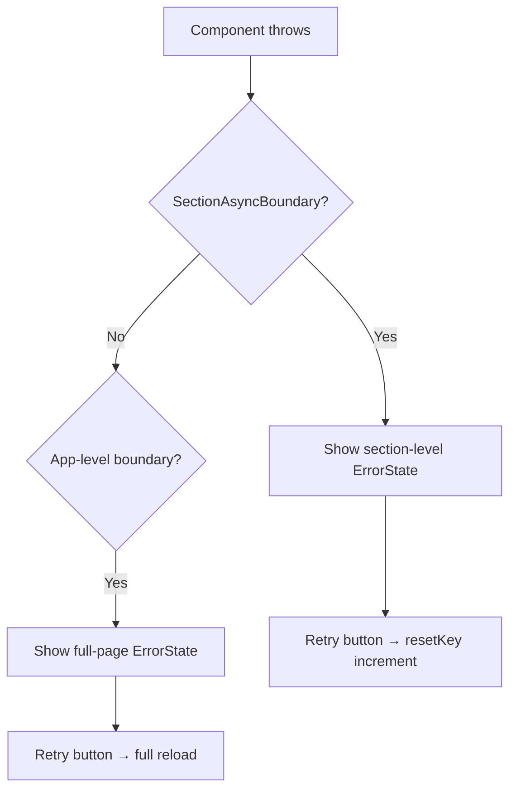

# Dokumen Desain Teknis: Dashboard Audit Improvements

## Overview

Dokumen ini mendeskripsikan desain teknis untuk perbaikan hasil audit pada sistem Instagram tracker dashboard. Perbaikan mencakup cleanup artefak legacy, unifikasi kontrak data, penguatan kalkulator metrik, pemantauan kesegaran data, keamanan, observability, performance, accessibility, konsistensi UX, deployment, pipeline reliability, testing, dan dokumentasi.

### Konteks Sistem Saat Ini



### Tujuan Desain

1. **Eliminasi ambiguitas legacy** — Hapus atau isolasi artefak `dashboard/` yang tidak lagi di-serve
2. **Single source of truth untuk schema** — Satu file schema kanonik yang dikonsumsi builder, API, dan parser
3. **Metric calculator yang defensif** — Tidak pernah menghasilkan NaN/Infinity, deterministik
4. **Freshness monitoring proaktif** — Alert staleness di UI dan health endpoint
5. **Security hardening** — Hapus kredensial legacy, validasi server-side, security headers
6. **Observability** — Structured logging, health endpoint, error boundary konsisten
7. **Performance budget** — LCP < 2.5s, bundle < 250KB gzip, code splitting
8. **Accessibility compliance** — Keyboard navigable, ARIA labels, contrast ratios
9. **UX consistency** — Formatter tunggal, palette konsisten, empty states
10. **Deterministic deployment** — Single Vercel config, env-driven URLs, commit SHA header
11. **Pipeline reliability** — Fail-fast, schema validation pre-write, artifact preservation
12. **Comprehensive testing** — Property-based tests untuk metric calculator dan parser round-trip
13. **Living documentation** — Audit report, migration docs, schema docs

## Architecture

### Arsitektur Target

```mermaid
graph TD
    subgraph Config["Konfigurasi"]
        ACC[config/accounts.json]
        PIPE[config/pipeline.json]
    end

    subgraph Pipeline["Data Pipeline"]
        COLLECT[Collectors: SocialBlade + Apify]
        CALC[calc-instagram-metrics.js - Hardened]
        BUILD[build-dashboard-data.js]
        VALIDATE_BUILD[Schema Validation Pre-Write]
        SNAPSHOT[data/dashboard-snapshot.json]
        
        ACC --> COLLECT
        PIPE --> COLLECT
        COLLECT --> CALC
        CALC --> BUILD
        BUILD --> VALIDATE_BUILD
        VALIDATE_BUILD -->|valid| SNAPSHOT
        VALIDATE_BUILD -->|invalid| FAIL[Exit non-zero]
    end

    subgraph Artifacts["Artifacts"]
        ART[artifacts/instagram/<account>-*.json]
        CALC --> ART
    end

    subgraph API["Serverless API"]
        HANDLER[/api/dashboard-data]
        HEALTH[/api/health]
        HANDLER -->|fetch DASHBOARD_DATA_URL| REMOTE[GitHub Raw]
        HANDLER -->|fallback| SNAPSHOT
        HANDLER -->|validate schema| SCHEMA
        HANDLER -->|structured log| LOG[JSON Logs]
    end

    subgraph Schema["Schema Kanonik"]
        SCHEMA[src/data/schema.ts - Single Source]
    end

    subgraph Frontend["React Dashboard"]
        APP[App.tsx]
        ADAPTER[adapter.ts]
        FRESH[FreshnessMonitor]
        ERR[ErrorBoundary + ErrorState]
        
        APP -->|fetch /api/dashboard-data| HANDLER
        APP --> ADAPTER
        ADAPTER -->|parse + validate| SCHEMA
        APP --> FRESH
        APP --> ERR
    end

    subgraph Security["Security Layer"]
        HEADERS[Security Headers: X-Content-Type-Options, X-Frame-Options, CSP]
        SECRET_CHECK[Secret Leakage Check - CI]
    end

    subgraph Docs["Dokumentasi"]
        AUDIT_DOC[docs/audit-report.md]
        SCHEMA_DOC[docs/dashboard-data-schema.md]
        MIGRATION_DOC[docs/dashboard-migration.md]
    end
```

### Keputusan Arsitektur

| Keputusan | Pilihan | Alasan |
|-----------|---------|--------|
| Schema format | Zod (TypeScript) | Sudah dipakai di codebase, type inference gratis, composable |
| Schema location | `dashboard-react/src/data/schema.ts` | Tetap di sini sebagai single source, diexport untuk builder |
| Metric calculator language | Node.js (tetap) | Sudah berjalan, cukup tambah defensive checks |
| Health endpoint | Vercel Serverless Function | Konsisten dengan API yang sudah ada |
| Property testing library | fast-check | Standar de facto untuk PBT di TypeScript/JavaScript |
| Structured logging | JSON ke stdout | Vercel log explorer membaca stdout JSON |
| CSP delivery | `<meta>` tag di `index.html` | Tidak perlu middleware Vercel untuk static assets |
| Focus trap | `focus-trap-react` | Sudah ada di dependencies |

## Components and Interfaces

### 1. Metric Calculator (`calc-instagram-metrics.js`) — Hardened

```typescript
// Interface kontrak (pseudocode TypeScript untuk dokumentasi)
interface MetricCalculatorInput {
  account: string          // non-empty string
  followers: number        // positive finite integer
  posts: PostEntry[]       // array of post objects
}

interface PostEntry {
  likes?: number | null
  comments?: number | null
  type?: string
  url?: string
  timestamp?: string
}

interface MetricCalculatorOutput {
  account: string
  posts_analyzed: number
  followers: number
  total_likes: number
  total_comments: number
  avg_likes: number | null
  avg_comments: number | null
  engagement_rate: number | null
  content_breakdown: {
    reels: number
    carousels: number    // normalized dari "carousel"
    images: number       // normalized dari "image"
    videos: number       // normalized dari "video"
    unknown: number      // tipe tidak dikenal
    total_posts_analyzed: number
  }
}
```

**Invariant yang dijamin:**
- `engagement_rate` tidak pernah NaN/Infinity
- `reels + carousels + images + videos + unknown === posts_analyzed`
- `min(valid_likes) <= avg_likes <= max(valid_likes)` (jika ada likes valid)
- Idempotent: input identik → output identik byte-per-byte

### 2. Dashboard Runtime API (`/api/dashboard-data`)

```typescript
interface DashboardDataHandler {
  // GET /api/dashboard-data
  // Response: Dashboard_Payload JSON (validated)
  // Headers: Cache-Control, security headers, X-Dashboard-Commit
  // Errors: 405 (method), 422 (parse error), 502 (upstream fail)
}

interface HealthHandler {
  // GET /api/health
  // Response: HealthResponse JSON
}

interface HealthResponse {
  status: 'fresh' | 'stale' | 'critical'
  generated_at: string
  age_seconds: number
  accounts_count: number
}

interface StructuredLog {
  timestamp: string       // ISO 8601
  level: 'info' | 'warn' | 'error'
  event: string           // e.g. "fetch_upstream", "fallback_local", "validation_failed"
  duration_ms: number
  upstream_source: string // URL yang di-fetch
  status_code: number
}
```

### 3. Payload Parser & Validator

```typescript
// Existing: dashboard-react/src/data/schema.ts
// Enhancement: strict mode, version check, normalized field names

interface ParseResult<T> {
  success: true
  data: T
} | {
  success: false
  errors: ValidationError[]
}

interface ValidationError {
  path: string      // dot-path notation, e.g. "content_breakdown.metmalbekasi.carousel"
  message: string   // human-readable reason
  code: string      // machine-readable error code
}
```

### 4. Freshness Monitor (React Component)

```typescript
interface FreshnessState {
  status: 'fresh' | 'stale' | 'critical' | 'unavailable'
  generatedAtWib: string
  latestDate: string
  ageSeconds: number
  sourceLabel: string
  dataSource: 'live' | 'cached'
}

// Thresholds
const STALE_THRESHOLD_SECONDS = 86400    // 24 jam
const CRITICAL_THRESHOLD_SECONDS = 172800 // 48 jam
```

### 5. Security Headers Middleware

```typescript
const SECURITY_HEADERS = {
  'X-Content-Type-Options': 'nosniff',
  'X-Frame-Options': 'DENY',
  'Referrer-Policy': 'strict-origin-when-cross-origin',
} as const

// CSP di index.html <meta> tag
const CSP_POLICY = "default-src 'self'; script-src 'self'; style-src 'self' 'unsafe-inline'; img-src 'self' data: https:; connect-src 'self' https://raw.githubusercontent.com"
```

### 6. CI/CD Pipeline Checks



## Data Models

### Dashboard Payload Schema v2 (Kanonik)

```typescript
// Single source: dashboard-react/src/data/schema.ts
// Perubahan dari state saat ini:
// 1. content_breakdown field dinormalisasi: carousels (bukan carousel), images (bukan image), videos (bukan video)
// 2. version field digunakan untuk compatibility check
// 3. Strict mode: sinonim ditolak

const SUPPORTED_VERSIONS = [2] as const

const normalizedContentBreakdownSchema = z.object({
  reels: z.number().optional(),
  carousels: z.number().optional(),     // BUKAN "carousel"
  images: z.number().optional(),         // BUKAN "image"  
  videos: z.number().optional(),         // BUKAN "video"
  unknown: z.number().optional(),        // tipe tidak dikenal
  total_posts_analyzed: z.number().optional(),
  posts: z.number().optional(),
  followers: z.number().optional(),
  bestPost: z.object({
    url: z.string().optional(),
    type: z.string().optional(),
    interactions: z.number().optional(),
    comments: z.number().optional(),
    timestamp: z.string().optional(),
    id: z.string().optional(),
    caption: z.string().optional(),
  }).optional(),
}).strict()  // Reject unknown fields
```

### Domain Model (Frontend)

```typescript
// Existing: dashboard-react/src/data/types.ts
// DashboardRecord tetap sebagai domain model internal
// Adapter mentransformasi DashboardApi → DashboardRecord
// Perubahan: ContentBreakdownAccountShape menggunakan nama normalized
```

### Config Models

```typescript
// config/accounts.json
interface AccountConfig {
  username: string
  followers: number      // baseline followers untuk metric calc
  enabled: boolean
}

// config/pipeline.json  
interface PipelineConfig {
  latestPostsCount: number
  collectProfileStats: boolean
  collectPostData: boolean
  calculateMetrics: boolean
  mergeDataset: boolean
  syncSheets: boolean
}
```

### Artifact Storage

```
artifacts/instagram/
├── <account>-latest12-full.json    # Raw post data dari Apify
├── <account>-metrics.json          # Output calc-instagram-metrics.js
data/
└── dashboard-snapshot.json         # Relocated dari dashboard/data.json
```

## Correctness Properties

*A property is a characteristic or behavior that should hold true across all valid executions of a system — essentially, a formal statement about what the system should do. Properties serve as the bridge between human-readable specifications and machine-verifiable correctness guarantees.*

### Property 1: Payload Round-Trip

*For any* valid `Dashboard_Payload` yang memenuhi schema kanonik v2, parsing dengan `Payload_Parser` kemudian serialisasi ke JSON kemudian parsing ulang SHALL menghasilkan struktur domain yang setara secara field-by-field (nilai primitif identik, kumpulan dengan anggota dan urutan yang sama).

**Validates: Requirements 2.5**

### Property 2: Content Breakdown Normalization

*For any* `Dashboard_Payload` yang dihasilkan oleh `Payload_Serializer`, field content breakdown SHALL hanya mengandung nama dari set `{reels, carousels, images, videos, unknown}` dan tidak mengandung sinonim (`carousel`, `image`, `video`). Payload yang mengandung sinonim SHALL ditolak oleh `Payload_Parser`.

**Validates: Requirements 2.4**

### Property 3: Parser Rejection with Error Paths

*For any* payload JSON yang tidak memenuhi schema kanonik (field hilang, tipe salah, atau nilai di luar batasan), `Payload_Parser` SHALL menolak payload tersebut dan mengembalikan daftar error di mana setiap entri berisi dot-path field yang gagal dan alasan kegagalan.

**Validates: Requirements 2.3**

### Property 4: Engagement Rate Computation Correctness

*For any* input ke `Metric_Calculator`, jika `followers` bukan bilangan bulat positif berhingga (0, negatif, null, NaN, Infinity) maka `engagement_rate` SHALL bernilai `null`. Jika `followers` valid dan terdapat posts dengan likes/comments valid, maka `engagement_rate` SHALL sama dengan `((avg_likes + avg_comments) / followers) * 100` dibulatkan ke 2 desimal menggunakan pembulatan half-up.

**Validates: Requirements 3.1, 3.2**

### Property 5: Type Count Invariant

*For any* kumpulan posts yang diproses oleh `Metric_Calculator`, jumlah `reels + carousels + images + videos + unknown` SHALL selalu sama dengan `posts_analyzed`.

**Validates: Requirements 3.7**

### Property 6: Average Bounded by Min-Max

*For any* kumpulan posts di mana setidaknya satu post memiliki nilai `likes` numerik valid, `avg_likes` yang dihasilkan `Metric_Calculator` SHALL berada di interval tertutup `[min(likes_valid), max(likes_valid)]`.

**Validates: Requirements 3.6**

### Property 7: Total Sum of Valid Entries Only

*For any* kumpulan posts dengan campuran nilai likes/comments valid dan invalid (null, NaN, Infinity, non-numerik), `total_likes` dan `total_comments` yang dihasilkan `Metric_Calculator` SHALL sama dengan penjumlahan hanya dari entri yang merupakan angka berhingga non-negatif.

**Validates: Requirements 3.5**

### Property 8: Metric Calculator Idempotence

*For any* input posts dan parameter `followers` yang identik, menjalankan `Metric_Calculator` dua kali berturut-turut SHALL menghasilkan dua output JSON yang identik secara byte-per-byte.

**Validates: Requirements 3.8**

### Property 9: No NaN/Infinity in Metric Output

*For any* input ke `Metric_Calculator` (termasuk edge cases: posts kosong, followers nol, likes null, tipe tidak dikenal), nilai numerik pada output (`avg_likes`, `avg_comments`, `engagement_rate`, `total_likes`, `total_comments`) SHALL tidak pernah berupa `NaN` atau `Infinity`; jika perhitungan tidak dapat dilakukan, field tersebut SHALL bernilai `null`.

**Validates: Requirements 3.10**

### Property 10: Freshness Status Classification

*For any* nilai `age_seconds` (selisih antara waktu saat ini dan `generated_at`), status kesegaran SHALL diklasifikasikan secara deterministik: `fresh` jika `age_seconds ≤ 86400`, `stale` jika `86400 < age_seconds ≤ 172800`, `critical` jika `age_seconds > 172800`. Klasifikasi ini SHALL konsisten antara `Freshness_Monitor` di frontend dan `/api/health` endpoint.

**Validates: Requirements 4.2, 4.3, 4.7**

### Property 11: History Dates Unique and Ascending

*For any* valid `Dashboard_Payload`, seluruh tanggal pada array `history` SHALL unik (tidak ada duplikat) dan terurut secara menaik (setiap tanggal lebih besar dari tanggal sebelumnya).

**Validates: Requirements 11.7**

### Property 12: All Enabled Accounts Present in Output

*For any* eksekusi `Data_Pipeline` yang sukses dengan konfigurasi `Account_Config` yang memiliki N akun `enabled = true`, output `Dashboard_Payload` SHALL mengandung tepat N entri di `accounts[]` dan N entri di `latest[account]`.

**Validates: Requirements 11.4**

### Property 13: Security Headers on Every API Response

*For any* request ke `Dashboard_Runtime_API` yang menghasilkan response sukses (2xx), response SHALL menyertakan header `X-Content-Type-Options: nosniff`, `X-Frame-Options: DENY`, dan `Referrer-Policy: strict-origin-when-cross-origin`.

**Validates: Requirements 5.5**

### Property 14: Non-GET Method Rejection

*For any* HTTP request ke `Dashboard_Runtime_API` dengan method selain `GET` (POST, PUT, DELETE, PATCH, OPTIONS, HEAD, dll.), API SHALL mengembalikan HTTP 405 dengan header `Allow: GET`.

**Validates: Requirements 5.4**

## Error Handling

### Strategi Error per Layer

| Layer | Error Type | Handling |
|-------|-----------|----------|
| Metric Calculator | Invalid CLI args | Pesan usage ke stderr, exit code 1 |
| Metric Calculator | Input file not found | Error message ke stderr, exit code 1 |
| Metric Calculator | Invalid post data | Skip entry, log warning, lanjutkan |
| Metric Calculator | Division by zero | Return `null`, tidak crash |
| Payload Serializer | Build failure | Log error dengan nama tahap, exit non-zero |
| Payload Serializer | Schema validation fail | Log error paths, tidak tulis file, exit non-zero |
| Dashboard API | Upstream timeout (>8s) | Fallback ke local file |
| Dashboard API | All sources fail | HTTP 502 + JSON error body |
| Dashboard API | Invalid JSON from upstream | HTTP 422 + JSON error body |
| Dashboard API | Non-GET method | HTTP 405 + Allow header |
| Dashboard API | Schema validation fail | HTTP 502 + JSON error body |
| React Frontend | Fetch error | Show ErrorState + retry button |
| React Frontend | Render error | ErrorBoundary → ErrorState + console.error |
| React Frontend | Timeout (>15s) | Show cached data atau unavailable state |
| React Frontend | Abort (retry) | Cancel inflight, start new request |

### Error Response Format (API)

```typescript
// Semua error response dari API menggunakan format JSON konsisten
interface ApiErrorResponse {
  error: string        // Human-readable description
  code?: string        // Machine-readable error code (optional)
  timestamp?: string   // ISO 8601 timestamp
}

// Contoh:
// 502: { "error": "Upstream data source unavailable after 3 attempts" }
// 422: { "error": "Upstream response is not valid JSON" }
// 405: { "error": "Method not allowed" }
```

### React Error Boundary Strategy



### Retry Logic

- **Frontend retry**: `useDashboardData` hook abort inflight → new request
- **API retry**: Hingga 3 fallback sources (GitHub raw → local file)
- **Constraint**: Hanya satu request aktif pada satu waktu per client
- **State machine**: `idle → loading → success/error`, `idle → refreshing → success/error`

## Testing Strategy

### Pendekatan Dual Testing

Testing menggunakan dua pendekatan komplementer:

1. **Unit tests (example-based)**: Verifikasi skenario spesifik, edge cases, dan error conditions
2. **Property tests (property-based)**: Verifikasi universal properties across all inputs menggunakan **fast-check**

### Property-Based Testing Configuration

- **Library**: [fast-check](https://github.com/dubzzz/fast-check) (TypeScript)
- **Minimum iterations**: 100 per property test
- **Tag format**: `Feature: dashboard-audit-improvements, Property {number}: {property_text}`

### Test Suites

#### 1. Metric Calculator Tests (`calc-instagram-metrics.test.js`)

**Unit tests:**
- Posts kosong → avg_likes/avg_comments/engagement_rate = null
- Followers = 0 → engagement_rate = null
- Posts dengan tipe tidak dikenal → warning logged, counted as unknown
- Normal case → correct computation

**Property tests:**
- Property 4: ER computation correctness
- Property 5: Type count invariant
- Property 6: Average bounded by [min, max]
- Property 7: Total sum of valid entries only
- Property 8: Idempotence
- Property 9: No NaN/Infinity

#### 2. Payload Parser Tests (`schema.test.ts`)

**Unit tests:**
- Valid payload → parse success
- Missing required field → rejection with path
- Invalid version → rejection with version info
- Synonym fields → rejection (strict mode)

**Property tests:**
- Property 1: Round-trip (parse → serialize → parse)
- Property 2: Content breakdown normalization
- Property 3: Parser rejection with error paths

#### 3. Dashboard API Tests (`dashboard-data.test.ts`)

**Unit tests:**
- Sukses remote fetch → 200 + valid JSON
- Remote fail → fallback to local
- Invalid JSON upstream → 422
- Non-GET method → 405
- All sources fail → 502

**Property tests:**
- Property 13: Security headers on every response
- Property 14: Non-GET method rejection

#### 4. Freshness Monitor Tests

**Property tests:**
- Property 10: Freshness status classification

#### 5. Data Pipeline Tests

**Property tests:**
- Property 11: History dates unique and ascending
- Property 12: All enabled accounts present

#### 6. React Frontend Tests (`useDashboardData.test.ts`)

**Unit tests:**
- Loading state → data loaded → success state
- Fetch error → error state with message
- Retry → abort inflight + new request
- Cached data on error → show cached + error indicator

### Test Execution

```bash
# Semua tests (harus selesai < 120 detik)
npm test

# Property tests saja
npx vitest run --grep "property"

# Metric calculator tests
npx vitest run calc-instagram-metrics

# Schema/parser tests
npx vitest run schema.test
```

### CI Integration

```yaml
# Pseudo CI config
steps:
  - npm ci
  - npm run build          # TypeScript + Vite (exit non-zero on error)
  - npm test               # Vitest run (< 120s)
  - secret-leakage-check   # Scan build artifacts
  - schema-doc-sync-check  # Verify docs match schema
  - deploy (if main)
```

